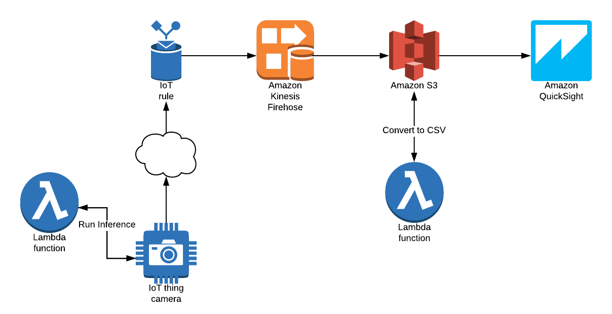

# DeepLensChallenge
### Challenge
Submission for the [AWS DeepLens Challenge](https://awsdeeplens.devpost.com)

### Team
- Steven Muschler (2017 re:Invent Attendee)
- Valerie Hall
- Tim Pusateri

### Solution
Brand prevalence at certain locations and times is extremely valueable infromation as it allows marketing organizations to apply targeted ads in areas where their brand is struggling.  When we say brand, we are mostly focused on clothing brands.  For the purposes of this solution, Nike (swoosh logo) and Adidas (trefoil logo).  The solution could enhanced to start tracking other brands, such as Puma.

### Model Training
The first step to accomplish this goal is to train a model using a SageMaker Notebook Instance to detect Nike and Adidas logos.  The process for creating a dataset and training a model for this solution is documented in the following [gist](gist.md).

### Architecture

### Deploying the Solution
The full solution is comprised of two major pieces.  The infrastructure running in AWS, that is deployed via CloudFormation template and the model and Lambda that are deployed on the DeepLens.

#### DeepLens Deployment
To deploy the model and lambda to the DeepLens, use the following artifacts.  Instructions for DeepLens deployments can be found [here](https://docs.aws.amazon.com/deeplens/latest/dg/deeplens-create-deploy-sample-project.html).

Model Artifacts:
Hearts and Stars
- [mxnet_deploy_ssd_resnet50_512_FP16_FUSED.bin](model/HeartsAndStars/mxnet_deploy_ssd_resnet50_512_FP16_FUSED.bin)
- [mxnet_deploy_ssd_resnet50_512_FP16_FUSED.xml](model/HeartsAndStars/mxnet_deploy_ssd_resnet50_512_FP16_FUSED.xml)

Nike and Adidas
- [mxnet_deploy_ssd_resnet50_512_FP16_FUSED.bin](model/NikeAndAdidas/mxnet_deploy_ssd_resnet50_512_FP16_FUSED.bin)
- [mxnet_deploy_ssd_resnet50_512_FP16_FUSED.xml](model/NikeAndAdidas/mxnet_deploy_ssd_resnet50_512_FP16_FUSED.xml)

Lambda Artifacts:
- [deeplens-object-detection.zip](deeplensLambda/deeplens-object-detection-55cbb706-fd05-44af-a713-991f045f4cda.zip)

The Lambda function was created by using the original Object Recognition Lambda from the DeepLens sample projects.  It was modified for our use case.

Note that the Resnet param files were larger than 100MB, so they were upload to GitHub as zip files.  To use in future training, unzip the param files.

### Infrastructure Deployment
To deploy the AWS infrastructure, perform the following steps:
- Upload the [convertToCsv.zip](lambda/convertToCsv.zip) Lambda function to S3
- Set [S3Bucket and S3Key](teamworkDreamwork.template#L89-L90) to the location of where you uploaded the Lambda zip file
- Set [Sql](teamworkDreamwork.template#L153) to the MQTT topic of your DeepLens camera
- Execute the [TeamworkDreamwork](teamworkDreamwork.template) CloudFormation template
- To import data into Quicksight, use this [manifest file](quicksight/manifest.json).  NOTE: the bucket provisioned in the CloudFormation template must be specified [here](quicksight/manifest.json#L3).  In addition, the path should point to the time period of Firehose data that is to be imported.
